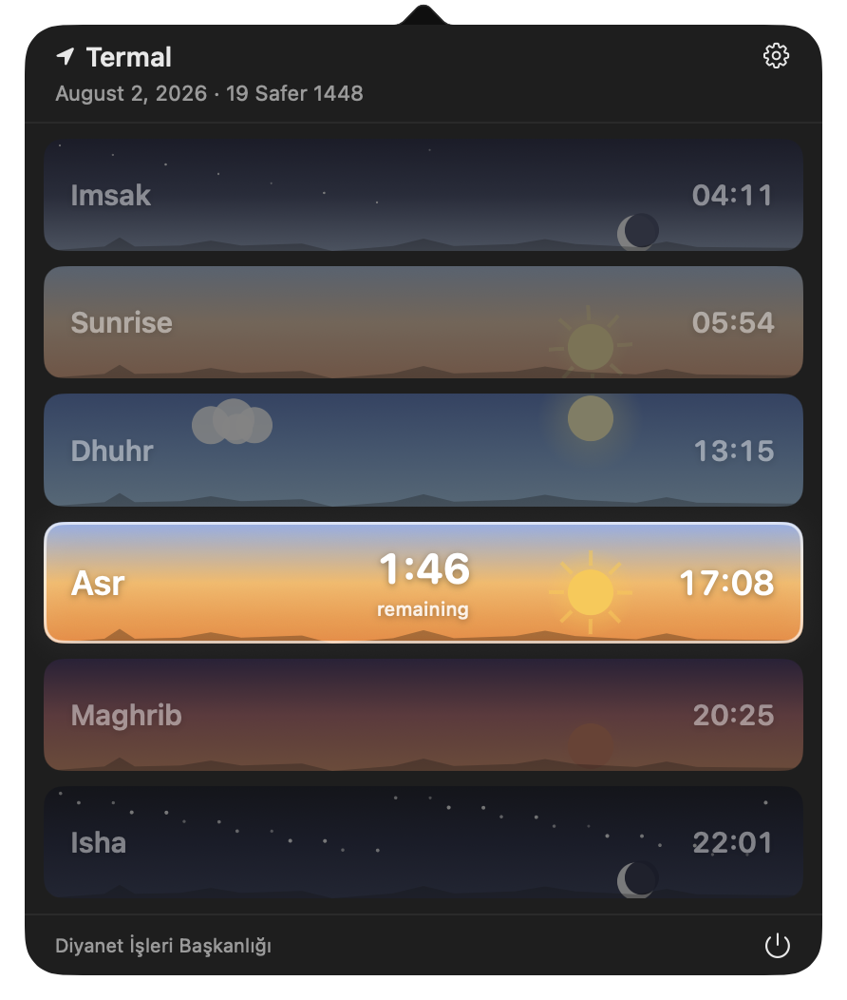
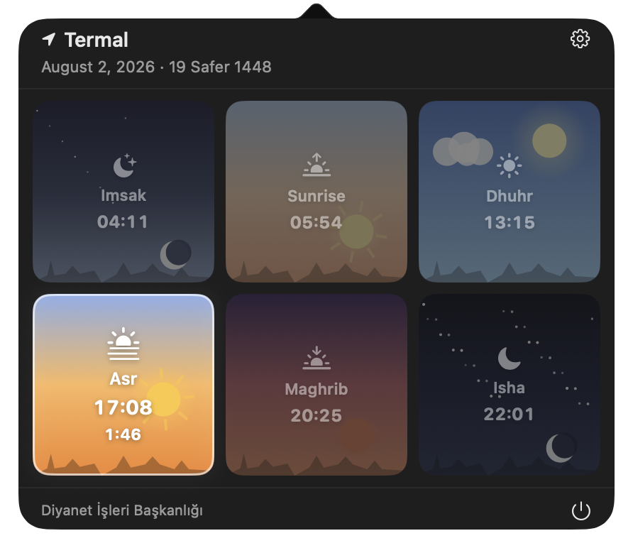
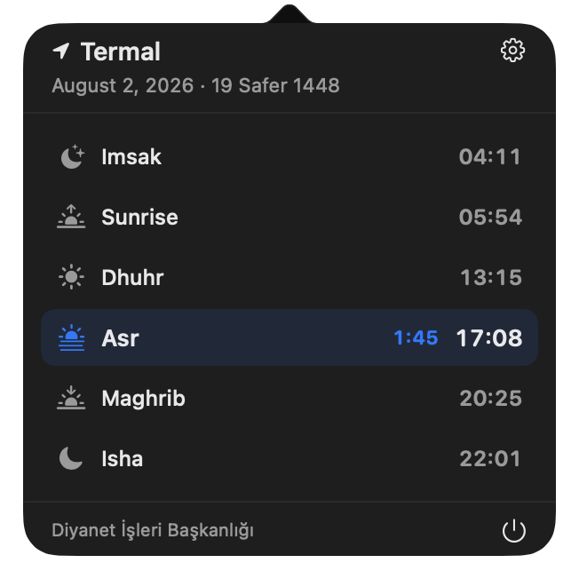
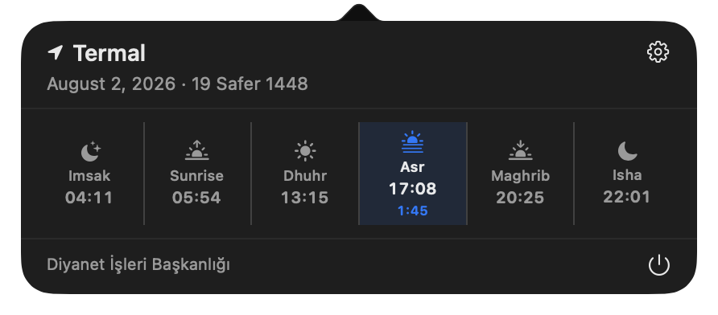
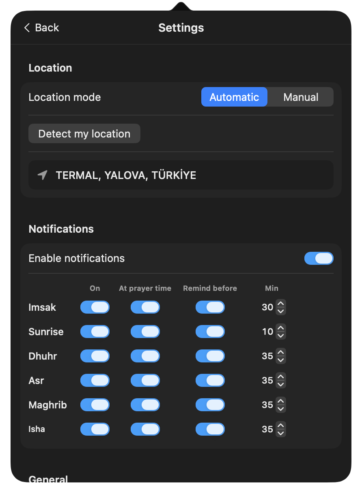
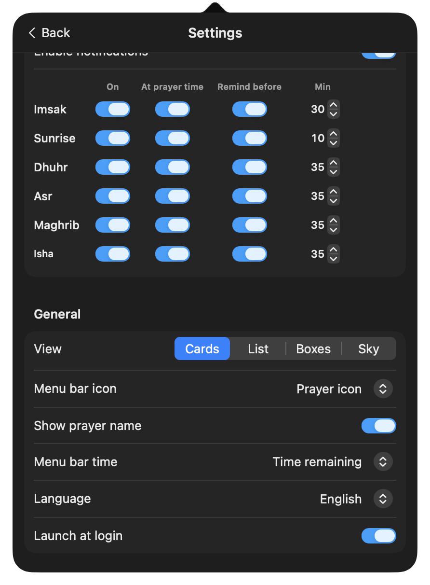
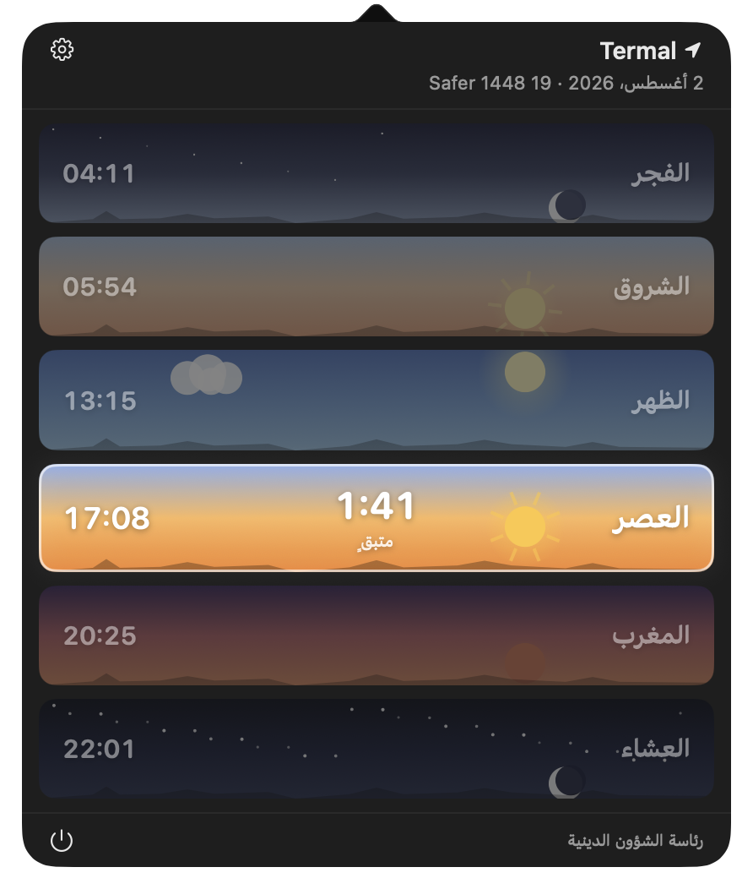

<div align="center">


# Prayer Times

**تطبيق أصلي لشريط قوائم macOS يعرض مواقيت الصلاة اعتماداً على بيانات ديانت الرسمية.**


</div>

<div align="center">

[English](../README.md) ·
[Türkçe](README.tr.md) ·
**العربية** ·
[فارسی](README.fa.md) ·
[اردو](README.ur.md) ·
[Bahasa Indonesia](README.id.md) ·
[Bahasa Melayu](README.ms.md) ·
[Bosanski](README.bs.md) ·
[Shqip](README.sq.md) ·
[Azərbaycan](README.az.md) ·
[Deutsch](README.de.md) ·
[Français](README.fr.md) ·
[Nederlands](README.nl.md) ·
[Русский](README.ru.md)

</div>

---

## نظرة عامة

يبقى Prayer Times في شريط القوائم ويعرض دائماً الصلاة التي أنت في وقتها الآن، مع عدّاد تنازلي حتى انتهاء وقتها. عند النقر على العنصر في شريط القوائم تُفتح لوحة تعرض المواقيت الستة كاملة لموقعك، مرسومة على شكل بطاقات بخلفية سماء تتغيّر بحسب ساعة اليوم.

## لقطات الشاشة

### أنماط اللوحة

تتوفر أربعة تخطيطات يمكن تبديلها من الإعدادات.

<table>
  <tr>
    <td align="center" width="50%">
      <br />
      <b>البطاقات</b> — بطاقات سماء بعرض كامل
    </td>
    <td align="center" width="50%">
      <br />
      <b>السماء</b> — شبكة مصوّرة ٣×٢
    </td>
  </tr>
  <tr>
    <td align="center">
      <br />
      <b>القائمة</b> — صفوف مضغوطة بأيقونات
    </td>
    <td align="center">
      <br />
      <b>المربعات</b> — صف واحد مضغوط
    </td>
  </tr>
</table>

### الإعدادات

<table>
  <tr>
    <td align="center" width="50%">
      <br />
      الموقع والتنبيهات لكل صلاة
    </td>
    <td align="center" width="50%">
      <br />
      نمط العرض وشريط القوائم واللغة
    </td>
  </tr>
</table>

### اللغات من اليمين إلى اليسار

<div align="center">
  
</div>

عند اختيار العربية أو الفارسية أو الأردية تنقلب الواجهة بالكامل من اليمين إلى اليسار.

## المزايا

- **نظرة سريعة من شريط القوائم** — اسم الصلاة الحالية والوقت المتبقي على انتهائها، يتحدّث كل ثانية
- **شريط قوائم قابل للتخصيص** — اختر الأيقونة (أيقونة الصلاة أو أيقونة التطبيق أو بدون)، أظهر اسم الصلاة أو أخفِه، واعرض الوقت المتبقي أو موعد الصلاة القادمة أو لا شيء
- **أربعة تخطيطات للوحة** — البطاقات والقائمة والمربعات والسماء
- **الموقع** — تحديد تلقائي عبر CoreLocation، أو اختيار يدوي للدولة والمحافظة والمنطقة
- **تنبيهات لكل صلاة** — فعّل كل صلاة على حدة، ونبّه في وقتها بالضبط و/أو قبلها بـ ٥–٦٠ دقيقة
- **يعمل دون اتصال** — تُخزَّن مواقيت شهر كامل في Application Support
- **التاريخ الهجري** في ترويسة اللوحة
- **التشغيل عند تسجيل الدخول**
- **١٤ لغة** مع دعم كامل للكتابة من اليمين إلى اليسار

## المتطلبات

- macOS 14 (Sonoma) أو أحدث
- Xcode 15 أو أحدث مع [XcodeGen](https://github.com/yonaskolb/XcodeGen) للبناء من المصدر

## البناء من المصدر

```bash
git clone https://github.com/lutfullahkabalak/prayer-times-for-mac.git
cd prayer-times-for-mac
xcodegen generate
open PrayerTimes.xcodeproj
```

ثم ابنِ وشغّل مخطط `PrayerTimes`. من سطر الأوامر:

```bash
xcodebuild -scheme PrayerTimes -destination 'platform=macOS' build
```

## الاختبارات

```bash
xcodebuild -scheme PrayerTimes -destination 'platform=macOS' test
```

## آلية العمل

التطبيق من نوع `LSUIElement`، لذا لا أيقونة له في الـ Dock ولا نافذة. عنصر شريط القوائم هو `NSStatusItem` مرسوم بـ AppKit، واللوحة هي `NSPopover` تستضيف واجهة SwiftUI. الصلاة النشطة هي الوقت **الذي أنت فيه** وليس الوقت التالي، لذا يخبرك العدّاد بما تبقّى من ذلك الوقت. بين منتصف الليل والإمساك يظل التطبيق يعرض العشاء.

تُجلب المواقيت شهرياً وتُحفظ بصيغة JSON في `~/Library/Containers/com.lutfullahkabalak.prayertimes/Data/Library/Application Support/PrayerTimes`، ليواصل التطبيق عمله دون اتصال بالإنترنت.

## اللغات

English, Türkçe, العربية, فارسی, اردو, Bahasa Indonesia, Bahasa Melayu, Bosanski, Shqip, Azərbaycan, Deutsch, Français, Nederlands, Русский.

تتبع اللغة إعداد النظام افتراضياً، ويمكن تغييرها من الإعدادات ← عام.

## مصدر البيانات

تأتي المواقيت من [Ezan Vakti İmsakiyem API](https://ezanvakti.imsakiyem.com) الذي ينشر المواقيت الرسمية الصادرة عن **رئاسة الشؤون الدينية التركية (Diyanet İşleri Başkanlığı)**.
