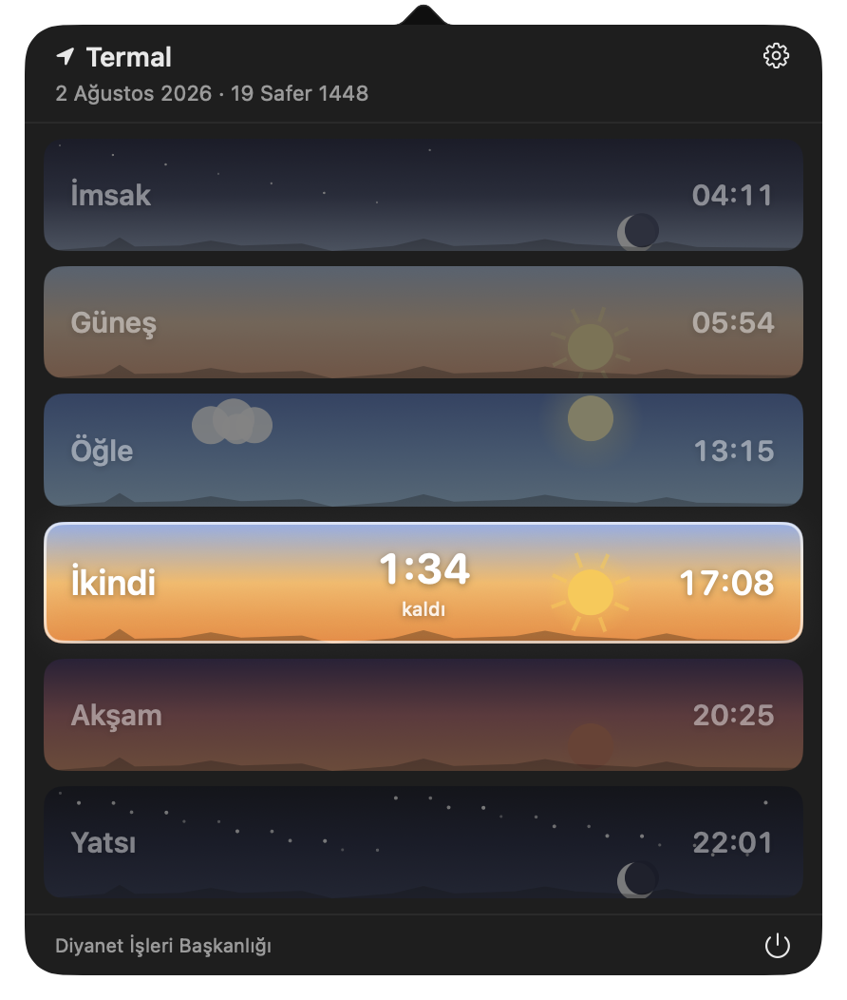
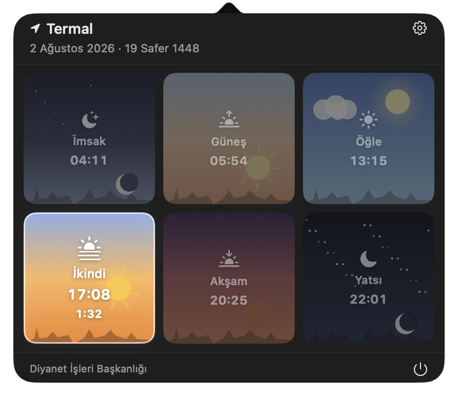
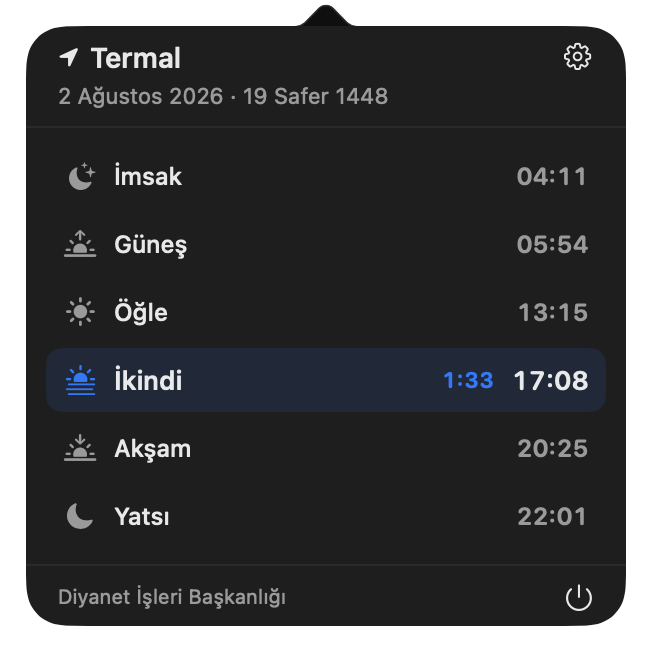
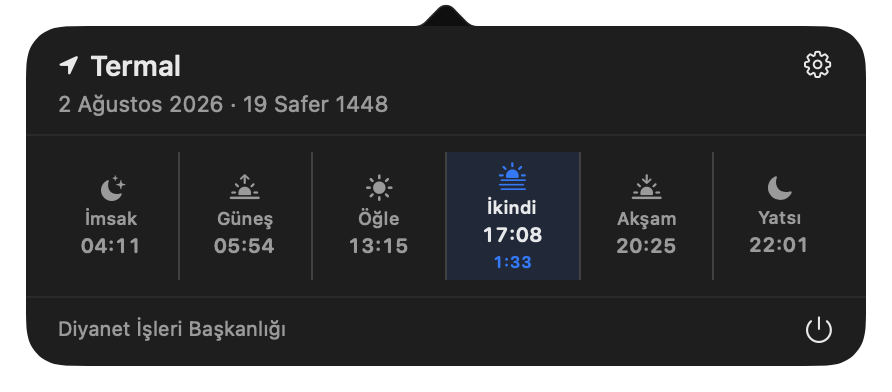
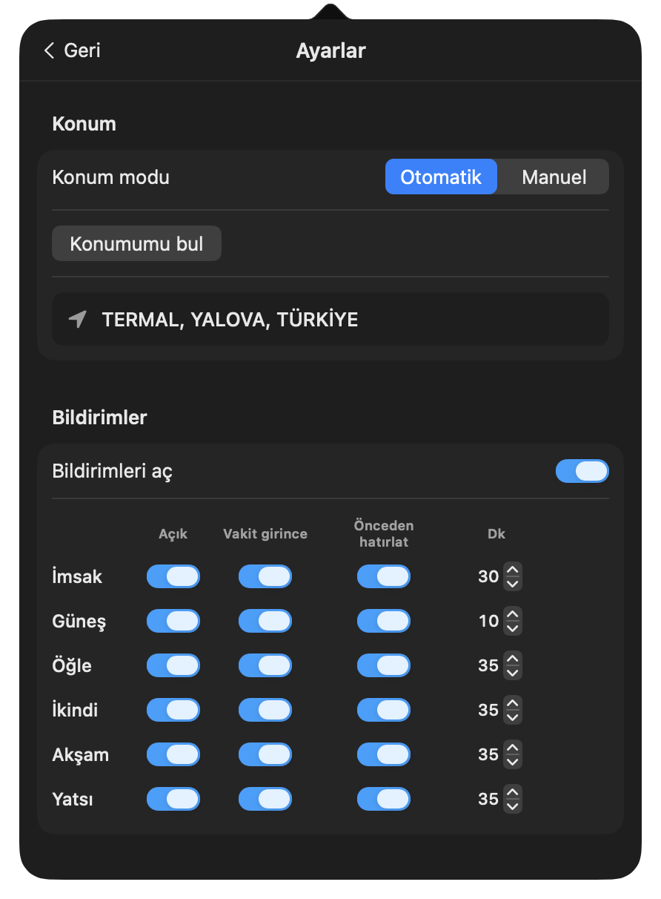
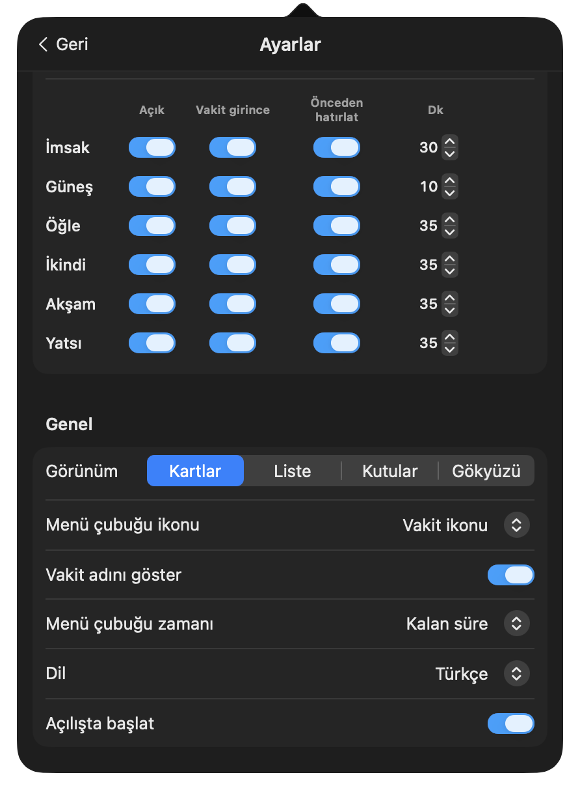

<div align="center">


# Prayer Times

**Diyanet'in resmî verilerini kullanan, macOS menü çubuğu için namaz vakitleri uygulaması.**


</div>

<div align="center">

[English](../README.md) ·
**Türkçe** ·
[العربية](README.ar.md) ·
[فارسی](README.fa.md) ·
[اردو](README.ur.md) ·
[Bahasa Indonesia](README.id.md) ·
[Bahasa Melayu](README.ms.md) ·
[Bosanski](README.bs.md) ·
[Shqip](README.sq.md) ·
[Azərbaycan](README.az.md) ·
[Deutsch](README.de.md) ·
[Français](README.fr.md) ·
[Nederlands](README.nl.md) ·
[Русский](README.ru.md)

</div>

---

## Genel bakış

Prayer Times menü çubuğunuzda durur ve içinde bulunduğunuz namaz vaktini, o vaktin bitmesine kalan süreyle birlikte gösterir. Menü çubuğundaki öğeye tıkladığınızda bulunduğunuz konuma ait altı vaktin tamamı açılır; kartlar günün saatine göre değişen gökyüzü temasıyla çizilir.

## Ekran görüntüleri

### Panel görünümleri

Ayarlar'dan seçebileceğiniz dört farklı yerleşim var.

<table>
  <tr>
    <td align="center" width="50%">
      <br />
      <b>Kartlar</b> — tam genişlikte gökyüzü kartları
    </td>
    <td align="center" width="50%">
      <br />
      <b>Gökyüzü</b> — 3×2 resimli ızgara
    </td>
  </tr>
  <tr>
    <td align="center">
      <br />
      <b>Liste</b> — simgeli sade satırlar
    </td>
    <td align="center">
      <br />
      <b>Kutular</b> — tek sıra hâlinde kompakt
    </td>
  </tr>
</table>

### Ayarlar

<table>
  <tr>
    <td align="center" width="50%">
      <br />
      Konum ve vakit bazlı bildirimler
    </td>
    <td align="center" width="50%">
      <br />
      Görünüm, menü çubuğu ve dil
    </td>
  </tr>
</table>

### Sağdan sola diller

<div align="center">
  
</div>

Arapça, Farsça ve Urduca seçildiğinde arayüzün tamamı sağdan sola döner.

## Özellikler

- **Menü çubuğunda tek bakışta** — içinde bulunulan vaktin adı ve bitişine kalan süre, saniye saniye güncellenir
- **Yapılandırılabilir menü çubuğu** — simgeyi seçin (namaz simgesi, uygulama simgesi veya hiçbiri), vakit adını gösterin ya da gizleyin, kalan süreyi / sonraki vaktin saatini gösterin veya hiçbirini göstermeyin
- **Dört panel yerleşimi** — Kartlar, Liste, Kutular ve Gökyüzü
- **Konum** — CoreLocation ile otomatik algılama veya elle ülke / il / ilçe seçimi
- **Vakit bazlı bildirimler** — her vakti ayrı ayrı açın, tam vaktinde ve/veya 5–60 dakika öncesinde uyarı alın
- **Çevrimdışı çalışır** — bir aylık vakitler Application Support içinde önbelleğe alınır
- **Hicri tarih** panel başlığında
- **Girişte otomatik başlatma**
- **14 dil** ve tam sağdan sola desteği

## Gereksinimler

- macOS 14 (Sonoma) veya üzeri
- Kaynaktan derlemek için Xcode 15+ ve [XcodeGen](https://github.com/yonaskolb/XcodeGen)

## Kaynaktan derleme

```bash
git clone https://github.com/lutfullahkabalak/prayer-times-for-mac.git
cd prayer-times-for-mac
xcodegen generate
open PrayerTimes.xcodeproj
```

Ardından `PrayerTimes` şemasını derleyip çalıştırın. Komut satırından:

```bash
xcodebuild -scheme PrayerTimes -destination 'platform=macOS' build
```

## Testler

```bash
xcodebuild -scheme PrayerTimes -destination 'platform=macOS' test
```

## Nasıl çalışıyor

Uygulama bir `LSUIElement` ajanı olduğu için Dock simgesi ve penceresi yoktur. Menü çubuğu etiketi AppKit ile çizilen bir `NSStatusItem`, panel ise SwiftUI görünümünü barındıran bir `NSPopover`'dır. Etkin vakit, bir sonraki değil **içinde bulunduğunuz** vakittir; geri sayım da o vaktin bitmesine kalan süreyi gösterir. Gece yarısı ile imsak arasında uygulama hâlâ yatsıyı gösterir.

Vakitler aylık olarak indirilir ve `~/Library/Containers/com.lutfullahkabalak.prayertimes/Data/Library/Application Support/PrayerTimes` altında JSON olarak saklanır; böylece internet bağlantısı olmadan da çalışmaya devam eder.

## Diller

English, Türkçe, العربية, فارسی, اردو, Bahasa Indonesia, Bahasa Melayu, Bosanski, Shqip, Azərbaycan, Deutsch, Français, Nederlands, Русский.

Dil varsayılan olarak sistem ayarınızı izler; Ayarlar → Genel bölümünden değiştirilebilir.

## Veri kaynağı

Namaz vakitleri, **Diyanet İşleri Başkanlığı**'nın yayımladığı resmî vakitleri sunan [Ezan Vakti İmsakiyem API](https://ezanvakti.imsakiyem.com) üzerinden alınır.
